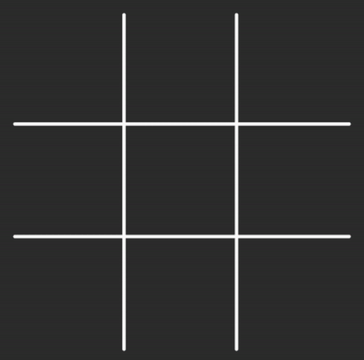
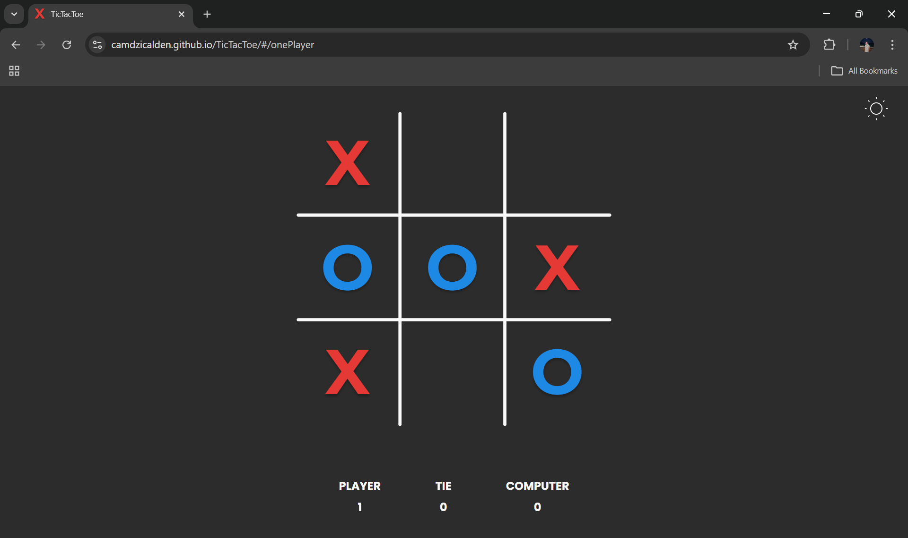
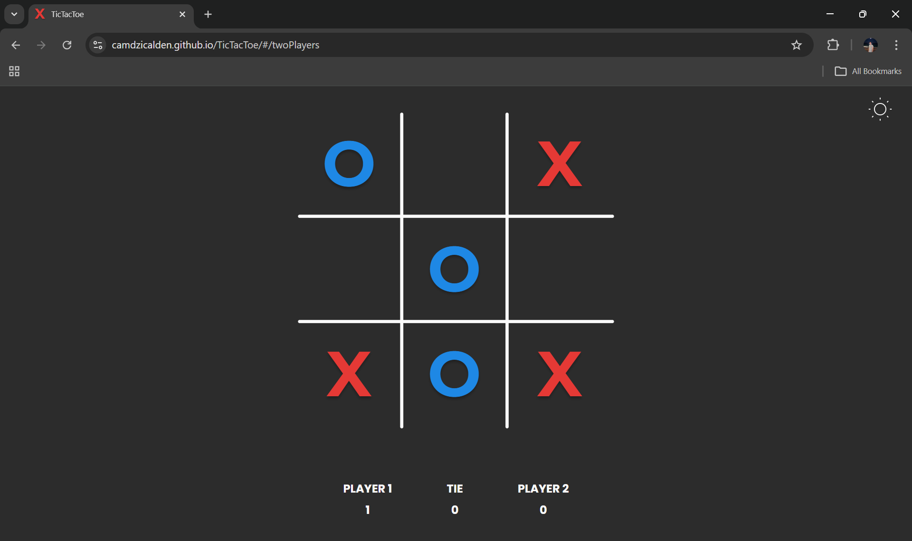

# 🎮 TicTacToe

<p align="center">
  
  
  
</p>

A modern, interactive **Tic-Tac-Toe** experience. <br>
Test your skills against the computer or a friend, and enjoy smooth gameplay with a clean, responsive interface. <br>
Choose between single-player or two-player mode and see who can claim victory!
<br><br>

<p align="center">
     
</p>

## 🖥️ Demo

<br>

🌐 **Try it now:** [https://camdzicalden.github.io/TicTacToe/](https://camdzicalden.github.io/TicTacToe/)

---

## Table of Contents 📑

- [How to Play 🎮](#how-to-play-)
- [Features ✨](#features-)
- [Game Logic 🧠](#game-logic-)
- [Technologies Used 🛠️](#technologies-used)
- [Installation & Setup 📥](#instalation-&-setup)
- [Future Improvements 🔮](#future-improvements-)
- [Author 👤](#author-)
- [License 📄](#license-)

---

## How to Play 🎮

1. Open the webpage in your browser.
2. Select a game mode:
   - 👤 **One Player** – Play as X against the computer.
   - 👥 **Two Players** – Take turns as X and O on the same device.
3. Click an empty cell to place your mark.
4. The game will announce a winner or a draw automatically.
5. Click the full board to **Restart** a game

---

## Features ✨

- **Two Game Modes**
  - 👤 **Single Player:** Challenge a basic AI opponent.

  <br>
    <p align="center">
     
    </p>
  <br>
  - 👥 <b>Two Players:</b> Play with a friend on the same device.

  <br>
    <p align="center">
     
    </p>
  <br>

- **Dark/Light mode:** Choose the color mode you prefer.
- **Responsive Design:** Fully functional on desktop and mobile.
- **Interactive UI:** Clean, intuitive interface with real-time updates.
- **Win/Draw Detection:** Highlights winning combinations and announces draws automatically.
- **Restart Option:** Reset the board to start a new game.

---

## Game Logic 🧠

- **Single Player AI:** Basic algorithm chooses moves strategically.
- **Two Player Mode:** Alternates turns until the board is full or a player wins.
- **Win Condition:** Three in a row (horizontal, vertical, diagonal).
- **Draw Condition:** Board is full with no winner.

---

<h2 id="technologies-used">Technologies Used 🛠️</h2>

| Technology    | Purpose                                 |
| ------------- | --------------------------------------- |
| ⚛️ React.js   | Component-based UI and state management |
| ⚡ Vite       | Fast development server and build tool  |
| 🎨 CSS3       | Styling and responsive layout           |
| 🌐 HTML5      | Basic page structure                    |
| 📝 JavaScript | Game logic and interactivity            |

---

<h2 id="instalation-&-setup">Installation & Setup 📥</h2>

1. **Install Node.js**
   <br>

   Make sure **Node.js** is installed on your system. You can download it from [https://nodejs.org/](https://nodejs.org/).

2. **Clone the repository**:

```bash
git clone git@github.com:CamdzicAlden/TicTacToe.git
```

3. **Navigate to the project folder**:

```bash
cd frontend
```

4. **Install dependencies**:

```bash
npm install
```

5. **Start the development server**:

```bash
npm run dev
```

6. **Open the provided local URL** (usually http://localhost:5173) and start playing!

---

## Future Improvements 🔮

- Improve AI logic (implement minimax algorithm)

- Add difficulty levels for one player mode

- Add online mode for playing on different devices

---

## Author 👤

**Alden Čamdžić**

---

## License 📄

<i>This project is open-source and free to use for educational purposes.</i>
